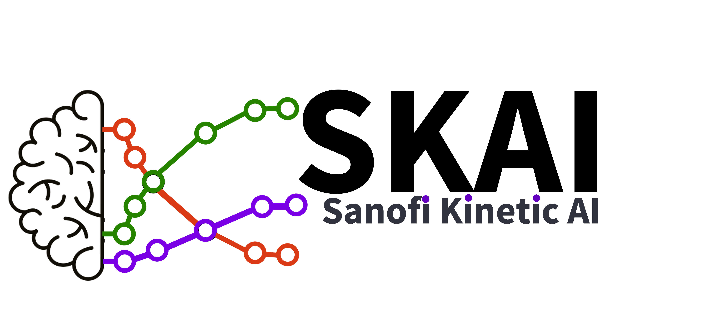

# SKAI

SKAI (Sanofi Kinetic AI) is a toolbox designed to assist scientst in the determination of reaction kinetics mechanisms using experimental data. It has a reaction network generator, which utilizes pre-trained machine learning models to construct reaction networks based on the provided data. Additionally, KineticAI offers a Bayesian inference modeling capability, leveraging the numpyro and JAX libraries. This allows users to rank different models based on their fit to the experimental data, providing valuable insights into the underlying kinetics of the system.
